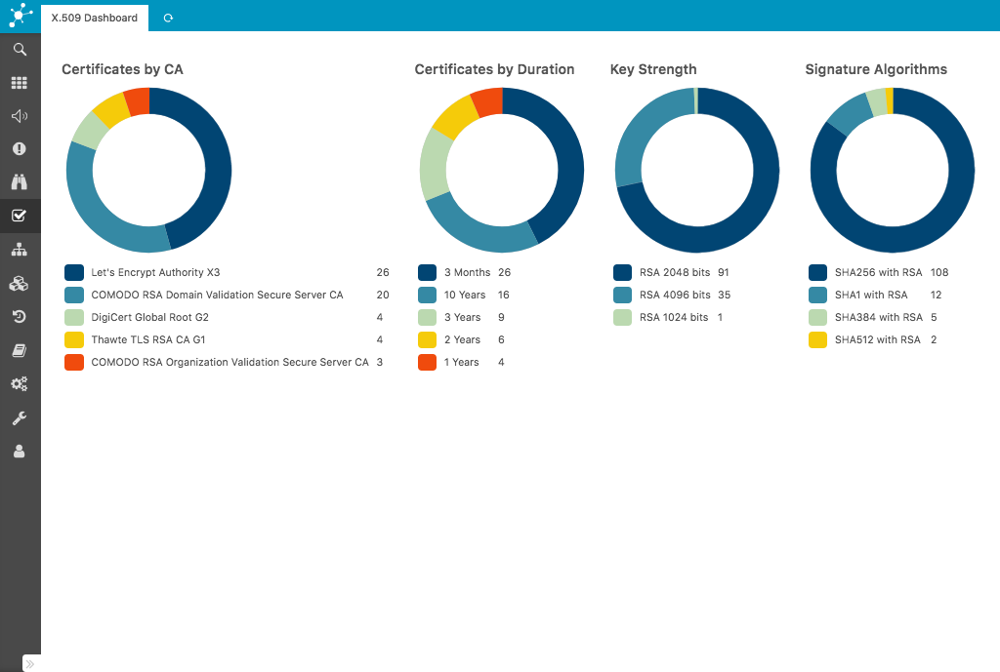
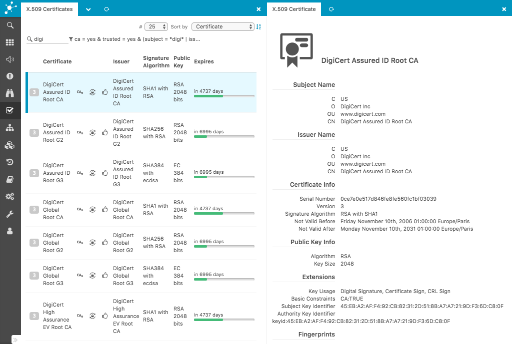
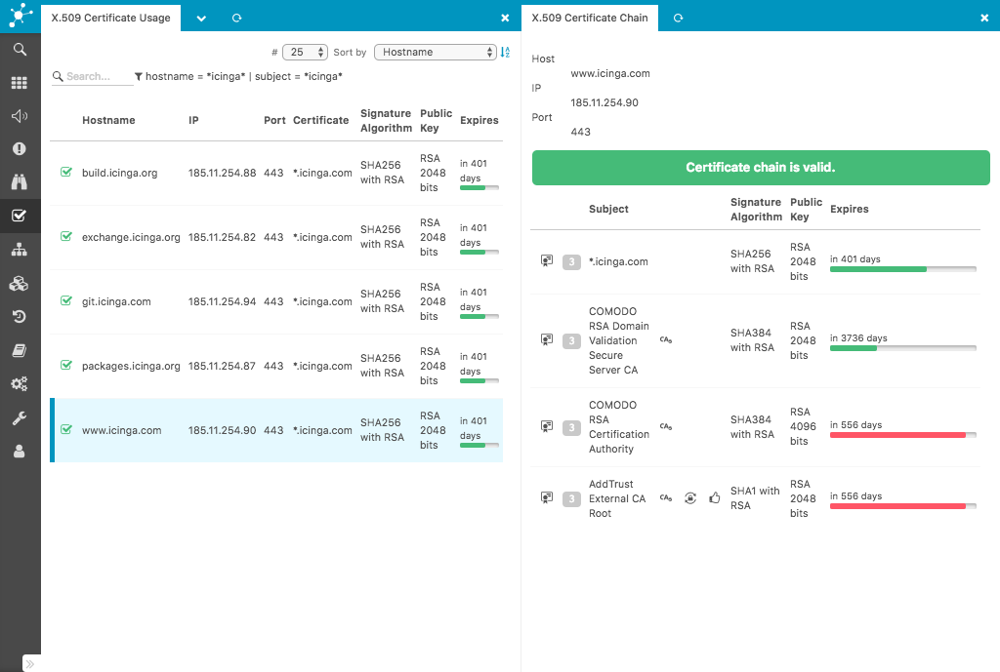

# Icinga Web 2 X.509 Module

The X.509 module for Icinga Web 2 keeps track of certificates as they're deployed in a network environment. It does
this by scanning a range of IP addresses and ports for TLS services and collects whatever certificates it finds
along the way. The module's web frontend can be used to view scan results:







## Requirements

* Icinga Web 2 (&gt;= 2.5)
* PHP (&gt;= 5.6, preferably 7.x)
* php-gmp
* OpenSSL
* MySQL or MariaDB
* composer
* Icinga Web 2 modules:
  * [reactbundle](https://github.com/Icinga/icingaweb2-module-reactbundle) (>= 0.4) (Icinga Web 2 module)
  * [Icinga PHP Library (ipl)](https://github.com/Icinga/icingaweb2-module-ipl) (>= 0.1) (Icinga Web 2 module)

### Database Setup

The module needs a MySQL/MariaDB database with the schema that's provided in the `etc/schema/mysql.schema.sql` file.

Note that if you're using a version of MySQL < 5.7, the following server options must be set:

```
innodb_file_format=barracuda
innodb_file_per_table=1
innodb_large_prefix=1
```

Example command for creating the MySQL/MariaDB database. Please change the password:

```
CREATE DATABASE x509;
GRANT SELECT, INSERT, UPDATE, DELETE, DROP, CREATE VIEW, INDEX, EXECUTE ON x509.* TO x509@localhost IDENTIFIED BY 'secret';
```

After, you can import the schema using the following command:

```
mysql -p -u root x509 < etc/schema/mysql.schema.sql
```

## Installation

1. You can install the X.509 module by extracting the installation archive in the `modules` directory for your
Icinga Web 2.

2. Run `composer install` in the x509 directory.

3. Log in with a privileged user in Icinga Web 2 and enable the module in `Configuration -> Modules -> x509`.
Or use the `icingacli` and run `icingacli module enable x509`.

4. Once you've set up the database, create a new Icinga Web 2 resource for it using the
`Configuration -> Application -> Resources` menu.

5. The next step involves telling the X.509 module which database resource to use. This can be done in
`Configuration -> Modules -> x509 -> Backend`.

This concludes the installation. You should now be able to import CA certificates and set up scan jobs:

## Importing CA certificates

The X.509 module tries to verify certificates using its own trust store. By default this trust store is empty and it
is up to the Icinga Web 2 admin to import CA certificates into it.

Using the `icingacli x509 import` command CA certificates can be imported. The certificate chain file that is specified
with the `--file` option should contain a PEM-encoded list of X.509 certificates which should be added to the trust
store:

```
icingacli x509 import --file /etc/ssl/certs/ca-certificates.crt
```

## Scan Jobs

The X.509 module needs to know which IP address ranges and ports to scan. These can be configured in
`Configuration -> Modules -> x509 -> Jobs`.

Scan jobs have a name which uniquely identifies them, e.g. `lan`. These names are used by the CLI command to start
scanning for specific jobs.

Each scan job can have one or more IP address ranges and one or more port ranges. The X.509 module scans each port in
a job's port ranges for all the individual IP addresses in the IP ranges.

IP address ranges have to be specified using the CIDR format. Multiple IP address ranges can be separated with commas,
e.g.:

`192.0.2.0/24,10.0.10.0/24`

Port ranges are separated with dashes (`-`). If you only want to scan a single port you don't need to specify the second
port:

`443,5665-5669`

Scan jobs can be executed using the `icingacli x509 scan` CLI command. The `--job` option is used to specify the scan
job which should be run:

```
icingacli x509 scan --job lan
```

## Scheduling Jobs

Each job may specify a `cron` compatible `schedule` to run periodically at the given interval. The `cron` format is as
follows:

```
*    *    *    *    *
-    -    -    -    -
|    |    |    |    |
|    |    |    |    |
|    |    |    |    +----- day of week (0 - 6) (Sunday to Saturday)
|    |    |    +---------- month (1 - 12)
|    |    +--------------- day of month (1 - 31)
|    +-------------------- hour (0 - 23)
+------------------------- minute (0 - 59)
```

Example definitions:

Description                                                 | Definition
------------------------------------------------------------| ----------
Run once a year at midnight of 1 January                    | 0 0 1 1 *
Run once a month at midnight of the first day of the month  | 0 0 1 * *
Run once a week at midnight on Sunday morning               | 0 0 * * 0
Run once a day at midnight                                  | 0 0 * * *
Run once an hour at the beginning of the hour               | 0 * * * *

Jobs are executed on CLI with the `jobs` command:

```
icingacli x509 robs run
```

This command runs all jobs which are currently due and schedules the next execution of all jobs.

You may configure this command as `systemd` service. Just copy the example service definition from
`config/systemd/icinga-x509.service` to `/etc/systemd/system/icinga-x509.service` and enable it afterwards:

```
systemctl enable icinga-x509.service
```

As an alternative if you want scan jobs to be run periodically, you can use the `cron(8)` daemon to run them on a
schedule:

```
vi /etc/crontab
[...]

# Runs job 'lan' daily at 2:30 AM
30 2 * * *   wwwdata   icingacli x509 scan --job lan
```
